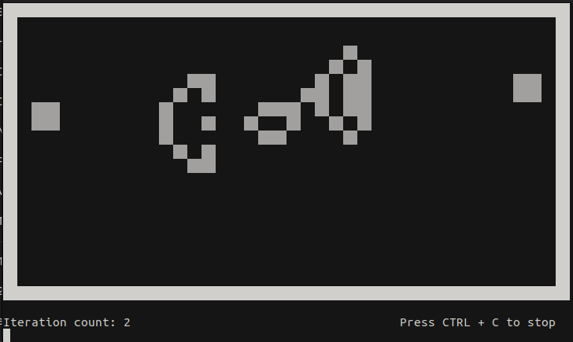

# Game of Life 🌍
Game of Life is a **cellular automaton** devised by the British mathematician *John Horton Conway* in 1970.
It is a zero-player game, meaning that its evolution is determined by its initial state, requiring no further input.

## Features:
- work on CLI, no external UI
- interactive menu
- made with no external libraries
- choose tick speed (default: 0.1)
- interation counter
- Recognize *stop of motion* and *two/three phase recursion*

## Available grids:
- Random grid
- Gosper glider gun

## Run the simulator:
```
./game-of-life-CLI.sh
```
If is not Linux (Ctrl + C and Ctrl + Z shortcuts will not work):

```
python3 game-of-life-CLI.py
```

## Screenshots:

Menu:


Simulation:


